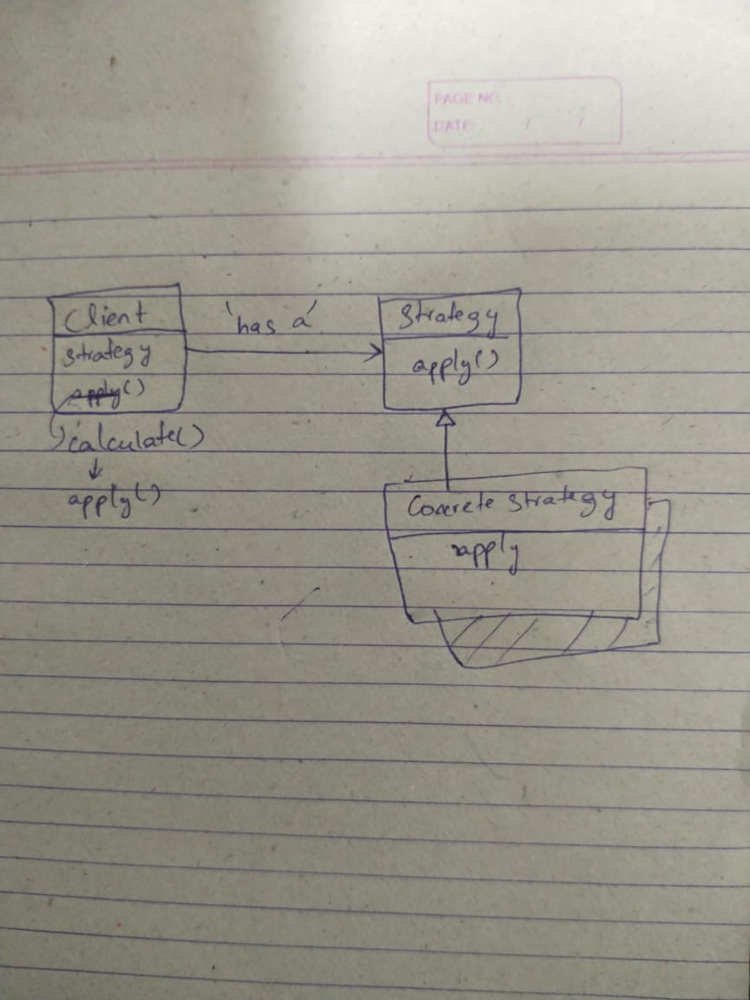

# Discount Strategy Pattern Example

This project demonstrates the **Strategy Design Pattern** in Java by providing a flexible system for applying various discounts to a purchase amount.

---

### Architecture & Design

The application follows the Strategy pattern to encapsulate different discount algorithms and make them interchangeable.

* **`IDiscountStrategy` (Strategy Interface)**: Defines a common `apply(double amount)` method for all discount algorithms.
* **Concrete Strategies**:
    * `NoDiscount`: Applies no discount, returning the original amount.
    * `FixedRateDiscount`: Applies a fixed percentage discount.
    * `ThresholdDiscount`: Applies a fixed discount amount only if the price is above a certain threshold. Implemented as a Java `record` for immutability.
* **`DiscountApplier` (Context)**: A class that holds a reference to a strategy object and uses it to perform the calculation. The strategy can be changed at runtime via the `setStrategy()` method.

This design decouples the `DiscountApplier` from the specific discount logic, making it easy to add new discount types without modifying existing code (Open/Closed Principle).

---

### Critical Analysis & Improvements

* **Strengths**:
    * Clean, well-documented implementation of the Strategy Pattern.
    * Robust validation in constructors and methods to prevent invalid states (e.g., negative amounts or discount rates).
    * Good use of modern Java features (`record`).

* **Areas for Improvement**:
    * **Use `BigDecimal` for Money**: For financial calculations, `double` is prone to precision errors. `java.math.BigDecimal` should be used instead for accuracy.
    * **Factory Pattern**: In a larger application, a Factory could be used to create and select strategies, further decoupling the client (`Main`) from concrete implementations.

---

### How to Run

1.  Compile all `.java` files:
    ```sh
    javac app/*.java
    ```
2.  Run the `Main` class:
    ```sh
    java app.Main
    ```
3.  **Expected Output**:
    ```
    FixedRateDiscount 40% off: 1800.0
    ThresholdDiscount $400 off >=1500: 2600.0
    ThresholdDiscount $400 off >=1500: 1499.0
    No discount: 3000.0
    No discount: 1499.0
    ```
    
### UAML diagram:
